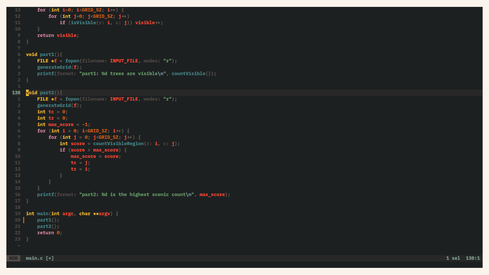
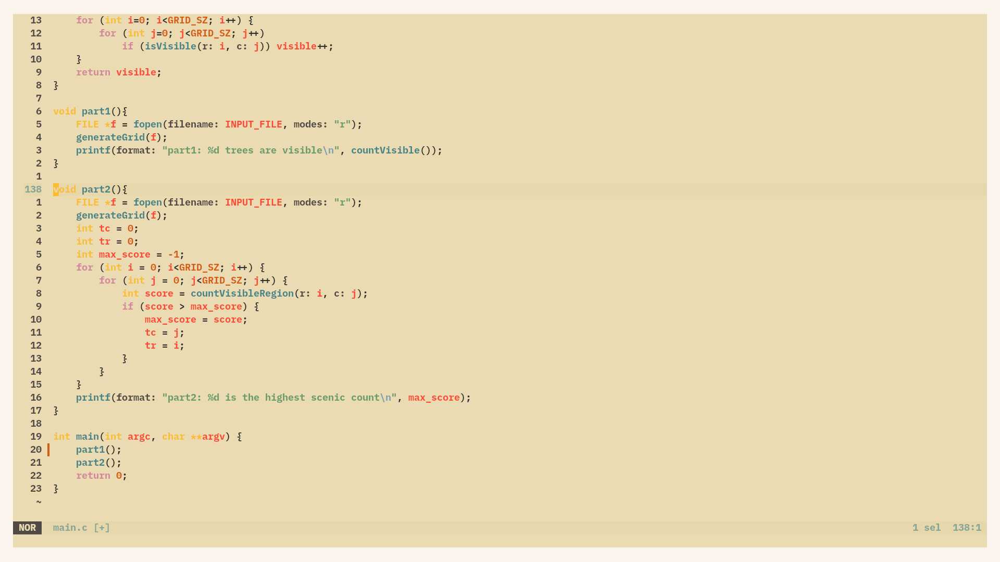

# Theme

This is the gruvbox theme that we all know and love ([Baby edition](https://github.com/luisiacc/gruvbox-baby)). A friend of mine ([@octvs](https://github.com/octvs)) and I were talking about base16 and how the idea is very cool but the theme ports are poor and he gave me an example with the gruvbox theme port. He also told me that he was using Gruvbox-Baby for his theme as it was more contrasty. I thought maybe if I could port it to base16 we would have a more contrasty gruvbox theme. And voilla. A more Contrasty Gruvbox theme for base16.

# Templates

Be careful with the templates you use. Some templates are not well done (e.g. the Helix-editor base16 template does not color the inlay-hints correctly).

# Screenshots

Here are some Screenshots for your mind and soul. 

